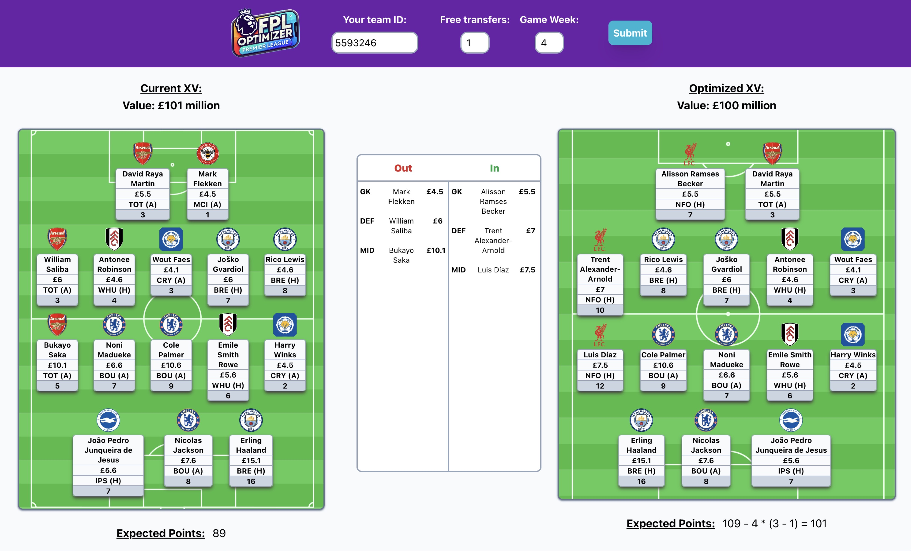

# FPL Optimizer

## Overview

I wanted to beat my friends in Fantasy Premier League this year so I decided to use mathematics and programming to help me win. The Premier League data is available via a public API (see information about the API at https://www.game-change.co.uk/2023/02/10/a-complete-guide-to-the-fantasy-premier-league-fpl-api/#google_vignette). The model is an optimization model that takes as inputs the user's current team, the number of free transfers they currently have, and the expected points of every player in the league for the upcoming game week. The expected points calculations are done outside of this repository and the results stored in a supabase instance, this will be updated weekly. Remember, this is just an experimental tool I built for fun, and don't make any assumptions about the validity of the players the model picks. I'll be making changes to the model periodically as the season progresses. Hopefully it can give you some inspiration for your transfers this week!

## Layout

Frontend code is in the `client` directory. `client/app` contains a fairly simple React app that prompts the user to submit their team ID, the number of free transfers they have, and the current gameweek, which is sent to the server. The response will contiain the user's current team and the optimized team from the model, as well as details about expected total points and which transfers to make.

Backend code is in the `server` directory. `server/app` contains the main backend code in `main.py`. The endpoint in this file receives the user's data in the request from the client, retrieves the user's official data with FPL API, and runs it through the optimization model defined in the file. The output is sent back to the client

```
FPLOptimizer/
├── client/ 
│   ├── app/
│   └── Dockerfile 
├── server/
│   ├── app/
│   ├── Dockerfile
│   └── requirements.txt
├── docker-compose.yml
├── FPLOPtimizer.jpeg # Example image of app after optimizing
└── README.md
```

## Client

The client app is built using React, Javascript and TailwindCSS and is designed to be fairly simple. Feel free to build on it.

To run the client separately, navigate to the `client/app` folder and run `npm start` in your terminal. You may need to `npm install` before to make sure you have the required dependencies.

## Server

The server code is written python FastAPI, and also uses the supabase API to retrieve the latest player data.

To run the server separately, navigate to the `server` folder and run `uvicorn app.__main__:app --reload` in your terminal. You will need to `pip install -r requirements.txt` before this to make sure you have the required dependencies. You can access the `/optimize` enpoint by running `curl http://localhost:8000/optimize/{yourTeamId}/{yourFreeTransfers}/{currentGameWeek}` in your terminal (make sure you replace the variables with your specific data)


## Docker

This application uses Docker to containerize the client and server applications and run them in parallel. If you have not used Docker before, please see their docs before cloning this repo.

To build and run the application using Docker, execute the following command in the root directory. This will run the client and server containers and the client app can be accessed at `http://localhost:3000`:

```
docker-compose up --build
```

## Walkthrough

Upon entering the app you will be prompted to enter the following information:

* Your team ID. This can be found by logging into your FPL account, going to 'Pick Team', then clicking on 'Gameweek History'. From there, check the website url. It should be something like: `https://fantasy.premierleague.com/entry/{teamId}/history` and you can copy your team ID from here.
* The number of free tranfers you have for this week. Check your FPL account, it should be between 1 and 5.
* The current game week, from 1-38. The game week starts on the day after the final match of the previous game week, and goes until the final matchday (i.e. if matches are from Friday to Sunday, each game week goes from Monday to Sunday night). NOTE: this tool shouldn't be used once the transfer deadline has passed each week, as FPL will be updating their data while the matches are being played. It is important you only use this tool with the current game week as it uses the most up to date expected points data, which is updated weekly. Inputting the incorrect week will cause it to break.


Once you click 'Submit', your data will be sent to the server in the API request, where it is then used to retrieve your team data from the FPL API and run the model on your team. The model will return the optimal team for you to build this week, taking into account the players' expected points and the points penalty for each 'non-free' transfer. The team will be displayed side by side with your current team, wit data about their respective values, expected points, and the transfers you need to make.


## Example:

